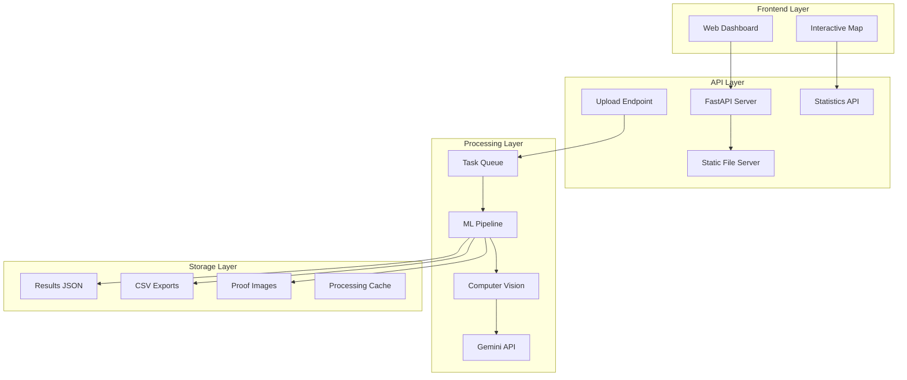

# Design Document: Drone Forest Monitoring System

## Overview

This system provides production-ready drone-based forest monitoring using computer vision and machine learning for tree health assessment. The architecture follows a microservices approach with FastAPI backend, integrated ML pipeline, and responsive web dashboard.

## Architecture



## Components and Interfaces

### 1. ML Processing Pipeline

**Core ML Model Architecture:**
- **Primary Model**: YOLOv8 for tree detection and localization
- **Secondary Model**: Custom CNN for health classification (Alive/Dead/Diseased)
- **Integration**: Google Gemini Vision API for enhanced classification accuracy
- **Preprocessing**: OpenCV for image normalization and augmentation

**Key Classes:**
```python
class MLProcessor:
    def detect_trees(self, image: np.ndarray) -> List[TreeDetection]
    def classify_health(self, tree_crop: np.ndarray) -> HealthClassification
    def process_with_gemini(self, crop: np.ndarray) -> GeminiResponse
    
class TreeDetection:
    bbox: BoundingBox
    confidence: float
    coordinates: Tuple[int, int]
    
class HealthClassification:
    status: TreeStatus  # ALIVE, DEAD, DISEASED
    confidence: float
    gemini_analysis: Optional[str]
```

### 2. FastAPI Backend Server

**API Endpoints:**
```python
# Core Processing
POST /api/upload-image          # Upload drone image for processing
GET  /api/process-status/{id}   # Check processing status
POST /api/process-batch         # Batch processing multiple images

# Data Retrieval
GET  /api/patches               # List all processed patches
GET  /api/patch/{patch_id}      # Get specific patch data
GET  /api/stats                 # Global statistics
GET  /api/export/{patch_id}     # Download CSV export

# File Management
GET  /static/images/{path}      # Serve original images
GET  /static/proofs/{path}      # Serve proof crops
GET  /static/results/{path}     # Serve result files
```

**Request/Response Models:**
```python
class ImageUploadRequest:
    file: UploadFile
    patch_name: str
    gps_coords: Optional[GPSCoordinates]
    
class ProcessingResponse:
    task_id: str
    status: ProcessingStatus
    estimated_time: int
    
class PatchAnalysisResult:
    patch_id: str
    total_trees: int
    health_distribution: Dict[TreeStatus, int]
    survival_rate: float
    processing_time: float
    timestamp: datetime
    tree_detections: List[TreeResult]
```

### 3. Asynchronous Task Processing

**Background Task System:**
```python
class TaskManager:
    def __init__(self):
        self.queue = asyncio.Queue()
        self.active_tasks = {}
        self.results_cache = {}
    
    async def submit_task(self, image_data: bytes, metadata: dict) -> str
    async def get_task_status(self, task_id: str) -> TaskStatus
    async def process_worker(self) -> None
```

**Processing Workflow:**
1. Image validation and preprocessing
2. Tree detection using YOLOv8
3. Individual tree crop extraction
4. Health classification with CNN + Gemini
5. Result aggregation and storage
6. Proof image generation and saving

## Data Models

### Database Schema (JSON-based)

**Results Structure:**
```json
{
  "patch_id": {
    "metadata": {
      "patch_name": "string",
      "upload_timestamp": "ISO8601",
      "processing_time": "float",
      "image_dimensions": [width, height],
      "gps_coordinates": {"lat": float, "lng": float}
    },
    "summary": {
      "total_trees": int,
      "alive_trees": int,
      "dead_trees": int,
      "diseased_trees": int,
      "survival_rate": float,
      "confidence_avg": float
    },
    "detections": [
      {
        "tree_id": int,
        "bbox": [x, y, width, height],
        "center": [x, y],
        "status": "ALIVE|DEAD|DISEASED",
        "confidence": float,
        "proof_image": "string|null",
        "gemini_analysis": "string|null"
      }
    ]
  }
}
```

### File Organization

```
data/
├── results.json              # Main results database
├── patches/
│   ├── {patch_id}/
│   │   ├── original.jpg      # Original drone image
│   │   ├── processed.jpg     # Annotated result image
│   │   ├── export.csv        # CSV export
│   │   └── proofs/           # Individual tree crops
│   │       ├── dead_001.jpg
│   │       ├── dead_002.jpg
│   │       └── diseased_001.jpg
└── cache/                    # Temporary processing files
```

## Correctness Properties

*A property is a characteristic or behavior that should hold true across all valid executions of a system-essentially, a formal statement about what the system should do. Properties serve as the bridge between human-readable specifications and machine-verifiable correctness guarantees.*

### Property 1: ML Model Accuracy
*For any* drone image in the test dataset with known ground truth, the ML model should achieve at least 85% detection accuracy when identifying individual trees
**Validates: Requirements 1.1**

### Property 2: Classification Completeness
*For any* detected tree in processed images, the classification result should be exactly one of ALIVE, DEAD, or DISEASED
**Validates: Requirements 1.2**

### Property 3: Processing Time Bounds
*For any* valid image file up to 10MB, the ML processing pipeline should complete analysis within 30 seconds
**Validates: Requirements 1.3**

### Property 4: Confidence Score Presence
*For any* tree classification performed by the system, the result should include a confidence score between 0.0 and 1.0
**Validates: Requirements 1.4**

### Property 5: Image Format Support
*For any* valid image file in JPEG, PNG, or TIFF format, the ML model should successfully process it without format-related errors
**Validates: Requirements 1.5**

### Property 6: Input Validation Consistency
*For any* file upload attempt, the system should validate format and size constraints and reject invalid files with appropriate error messages
**Validates: Requirements 2.1**

### Property 7: GPS Metadata Extraction
*For any* image with GPS metadata in EXIF data, the system should successfully extract and store the coordinates; for images without GPS data, the system should handle gracefully without errors
**Validates: Requirements 2.2**

### Property 8: Bounding Box Generation
*For any* tree detected in an image, the system should generate valid bounding box coordinates within the image dimensions
**Validates: Requirements 2.3**

### Property 9: Proof Image Generation
*For any* tree classified as DEAD or DISEASED, the system should save a cropped proof image in the designated proof directory
**Validates: Requirements 2.4**

### Property 10: Error Handling and Continuation
*For any* processing failure during batch operations, the system should log detailed error information and continue processing remaining images
**Validates: Requirements 2.5**

### Property 11: API Response Structure
*For any* completed image analysis, the API should return structured JSON containing all required fields (detections, summary, metadata)
**Validates: Requirements 3.2**

### Property 12: Static File Serving
*For any* stored proof image or result file, the API should serve it correctly through static file endpoints with proper HTTP headers
**Validates: Requirements 3.4**

### Property 13: Error Response Consistency
*For any* API error condition, the system should return appropriate HTTP status codes with descriptive error messages in consistent JSON format
**Validates: Requirements 3.5**

### Property 14: CORS Header Presence
*For any* API response, the system should include proper CORS headers to enable frontend integration
**Validates: Requirements 3.6**

### Property 15: Data Persistence Completeness
*For any* completed analysis, the system should store results in JSON format with timestamp, patch metadata, tree coordinates, and health classifications
**Validates: Requirements 4.1, 4.2**

### Property 16: CSV Export Generation
*For any* processed patch, the system should generate and maintain a CSV export file with all detection data
**Validates: Requirements 4.3**

### Property 17: Statistics Calculation Accuracy
*For any* set of processed patches, the aggregated statistics (survival rates, totals) should accurately reflect the sum of individual patch data
**Validates: Requirements 4.4**

### Property 18: File Organization Consistency
*For any* generated proof image, the system should organize it in the correct directory structure by patch and timestamp
**Validates: Requirements 4.5**

### Property 19: Dashboard Color Coding
*For any* tree result displayed on the dashboard, the marker color should correctly correspond to the tree's health status (green=ALIVE, red=DEAD, yellow=DISEASED)
**Validates: Requirements 5.2**

### Property 20: Patch Selection Updates
*For any* patch selected in the dashboard, the display should update to show the correct patch-specific data and associated proof images
**Validates: Requirements 5.4**

### Property 21: Configuration Flexibility
*For any* deployment environment, the system should accept port configuration through environment variables and start successfully
**Validates: Requirements 6.2**

### Property 22: Dependency Validation
*For any* system startup attempt, the system should validate all required dependencies and configurations, failing gracefully with descriptive messages if requirements are not met
**Validates: Requirements 6.4**

### Property 23: Concurrent Request Handling
*For any* set of up to 5 concurrent image processing requests, the system should handle all requests without failures or resource conflicts
**Validates: Requirements 7.1**

### Property 24: Request Queue Management
*For any* sequence of image processing requests, the system should queue them appropriately and process them in order without losing requests
**Validates: Requirements 7.2**

### Property 25: Performance Under Load
*For any* API endpoint under normal load conditions, response times should remain under 60 seconds
**Validates: Requirements 7.3**

### Property 26: Memory Management
*For any* extended processing session with multiple images, the system should maintain stable memory usage without memory leaks
**Validates: Requirements 7.4**

### Property 27: Progress Reporting
*For any* batch processing operation, the system should provide progress indicators through polling endpoints that accurately reflect processing status
**Validates: Requirements 7.5**

<function_calls>
<invoke name="prework">
<parameter name="featureName">drone-forest-monitoring

## Error Handling

### ML Processing Errors
- **Image Format Errors**: Graceful handling of unsupported formats with descriptive error messages
- **Memory Errors**: Automatic image resizing for large files, memory cleanup after processing
- **Model Loading Errors**: Fallback mechanisms and clear error reporting for missing model files
- **Gemini API Errors**: Retry logic with exponential backoff, fallback to local classification

### API Error Responses
```python
class ErrorResponse:
    error_code: str
    message: str
    details: Optional[Dict]
    timestamp: datetime
    request_id: str

# Standard Error Codes
ERRORS = {
    "INVALID_IMAGE_FORMAT": "Unsupported image format",
    "FILE_TOO_LARGE": "Image file exceeds size limit",
    "PROCESSING_FAILED": "ML processing pipeline failed",
    "INSUFFICIENT_RESOURCES": "System resources unavailable",
    "GEMINI_API_ERROR": "External API service error"
}
```

### Resilience Patterns
- **Circuit Breaker**: For Gemini API calls with automatic fallback
- **Retry Logic**: Exponential backoff for transient failures
- **Graceful Degradation**: Continue processing with reduced functionality
- **Health Checks**: Continuous monitoring of system components

## Testing Strategy

### Dual Testing Approach
The system employs both unit testing and property-based testing for comprehensive coverage:

**Unit Tests**: Verify specific examples, edge cases, and error conditions
- API endpoint functionality with known inputs
- ML model behavior with sample images
- File handling and storage operations
- Error scenarios and edge cases

**Property Tests**: Verify universal properties across all inputs
- ML model accuracy across diverse image datasets
- API response consistency for all valid requests
- Data persistence integrity for all processing results
- Performance characteristics under various load conditions

### Property-Based Testing Configuration
- **Testing Framework**: Hypothesis (Python) for property-based testing
- **Test Iterations**: Minimum 100 iterations per property test
- **Test Data Generation**: Custom generators for drone images, API requests, and system configurations
- **Coverage Requirements**: 90% code coverage for core ML and API components

### Test Categories

**ML Model Testing**:
```python
# Property Test Example
@given(drone_image=drone_image_generator(), 
       patch_metadata=patch_metadata_generator())
def test_ml_processing_completeness(drone_image, patch_metadata):
    """Feature: drone-forest-monitoring, Property 2: Classification Completeness"""
    result = ml_processor.process_image(drone_image, patch_metadata)
    
    for detection in result.detections:
        assert detection.status in ["ALIVE", "DEAD", "DISEASED"]
        assert 0.0 <= detection.confidence <= 1.0
```

**API Testing**:
```python
# Property Test Example  
@given(image_file=image_file_generator(),
       patch_name=patch_name_generator())
def test_api_response_structure(image_file, patch_name):
    """Feature: drone-forest-monitoring, Property 11: API Response Structure"""
    response = client.post("/api/upload-image", 
                          files={"file": image_file},
                          data={"patch_name": patch_name})
    
    assert response.status_code == 200
    data = response.json()
    assert "task_id" in data
    assert "status" in data
    assert "estimated_time" in data
```

**Integration Testing**:
- End-to-end workflow testing from image upload to result visualization
- Database consistency testing across concurrent operations
- File system integrity testing for proof image storage
- Performance testing under realistic load conditions

### Continuous Integration
- **Pre-commit Hooks**: Code formatting, linting, and basic unit tests
- **CI Pipeline**: Full test suite execution on every commit
- **Performance Benchmarks**: Automated performance regression testing
- **Security Scanning**: Dependency vulnerability scanning and code security analysis

## Deployment Architecture

### Docker Configuration
```dockerfile
# Multi-stage build for production optimization
FROM python:3.11-slim as base
WORKDIR /app
COPY requirements.txt .
RUN pip install --no-cache-dir -r requirements.txt

FROM base as production
COPY . .
EXPOSE 8000
CMD ["uvicorn", "api.main:app", "--host", "0.0.0.0", "--port", "8000"]
```

### Environment Configuration
```bash
# Production Environment Variables
ENVIRONMENT=production
API_PORT=8000
ML_MODEL_PATH=/app/models
GEMINI_API_KEY=${GEMINI_API_KEY}
MAX_CONCURRENT_REQUESTS=5
PROCESSING_TIMEOUT=30
LOG_LEVEL=INFO
```

### Health Monitoring
```python
@app.get("/health")
async def health_check():
    return {
        "status": "healthy",
        "timestamp": datetime.utcnow(),
        "version": "1.0.0",
        "ml_model_loaded": ml_processor.is_loaded(),
        "disk_space": get_disk_usage(),
        "memory_usage": get_memory_usage()
    }
```

This design provides a robust, scalable foundation for the hackathon project with production-ready ML integration, comprehensive error handling, and thorough testing coverage.