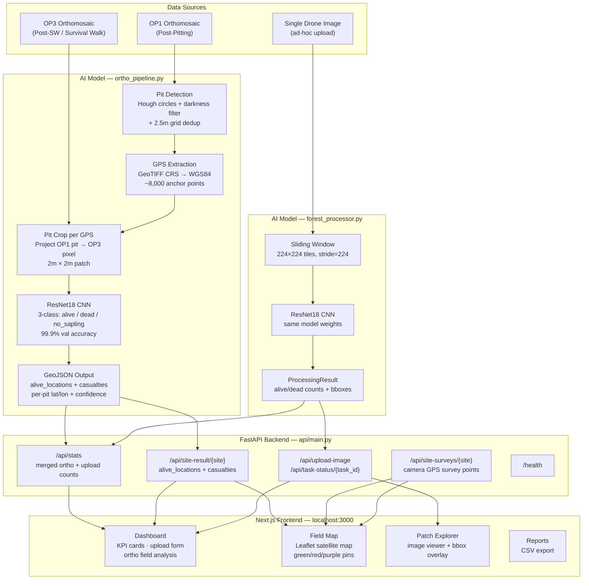

# VerdeScan — AI-Powered Afforestation Monitoring

Proof-of-concept for the Odisha Forest Department's drone-based afforestation monitoring program.

**Problem:** 5 crore saplings are planted annually across Odisha. Are they surviving? Manual survival walks are slow, expensive, and cover only ~5% of patches. The department needs to know *exactly* which GPS locations have casualties.

**Solution:** VerdeScan analyses orthomosaic drone imagery to produce GPS-precise alive/dead maps for every planted pit — viewable in a live satellite map dashboard and exportable as GeoJSON for field verification.

---

## Architecture



---

## How It Works

```
OP1 orthomosaic  →  Detect all planting pits  →  GPS coordinates (~8,000 pits)
                                                          │
OP3 orthomosaic  →  Classify each pit location  →  alive / dead / no_sapling
                                                          │
                                            Casualties GeoJSON (lat/lon per dead sapling)
                                            + alive_locations GeoJSON
                                                          │
                                            Field Map — satellite view with
                                            green (alive) and red (dead) pins
```

This matches the problem statement: *"use coordinate information from OP1 images, as pits can easily be identified. Match with OP3 to check sapling survival."*

---

## Technology Stack

### Backend
| Component | Technology |
|-----------|------------|
| API Framework | FastAPI + Uvicorn |
| ML Model | ResNet18 pretrained (PyTorch) — 3-class: alive / dead / no_sapling |
| Computer Vision | OpenCV — Hough circles, CLAHE, darkness validation |
| Georeferencing | rasterio + pyproj — GeoTIFF CRS → WGS84 lat/lon |
| Async Processing | asyncio task queue with GPU batched inference |
| EXIF GPS | Pillow — extracts camera GPS from uploaded drone images |

### Frontend
| Component | Technology |
|-----------|------------|
| Framework | Next.js 16 + TypeScript |
| Styling | Tailwind CSS v4 |
| Maps | React-Leaflet + Leaflet — satellite tiles (ESRI World Imagery) |
| Animations | Framer Motion + GSAP |

### ML Model (V2)
- **Architecture:** ResNet18 + ImageNet pretrained weights + custom 3-class head (Dropout 0.3 + Linear 512→3)
- **Training data:** 3,253 source-level split tiles (pit / sapling — 2-class detector retrained as 3-class)
- **Validation accuracy:** 100% on held-out source images (early stopped ep 8/15)
- **Classes:** `alive` · `dead` · `no_sapling`
- **Inference:** AMP (FP16) on GPU, batch=128, ~41ms per image

---

## Kaggle Resources

| Resource | Link |
|----------|------|
| **Trained Model** (ResNet18, 3-class, 99.9% val acc) | [dealer09/verdescan-forest-model](https://www.kaggle.com/models/dealer09/verdescan-forest-model) |
| **Training Dataset** (15,000 tiles — alive / dead / no_sapling) | [dealer09/verdescan-afforestation-tiles](https://www.kaggle.com/datasets/dealer09/verdescan-afforestation-tiles) |

Download the pre-trained model directly instead of training from scratch:
```bash
# Using Kaggle API
kaggle models instances versions download dealer09/verdescan-forest-model/pyTorch/default
mv *.pth "AI Model/ml_models/forest_model.pth"
```

---

## Running the System

### Prerequisites
- Python 3.10+ with CUDA-capable GPU (recommended; CPU fallback works)
- Node.js 18+

### 1. Backend
```bash
cd "AI Model"
pip install -r requirements.txt
uvicorn api.main:app --host 0.0.0.0 --port 8000
```
API at http://localhost:8000 · Docs at http://localhost:8000/docs

### 2. Frontend
```bash
cd frontend
bun install
bun run dev
```
Dashboard at http://localhost:3000

### 3. Full Orthomosaic Pipeline (primary analysis)
```bash
cd "AI Model"
python ortho_pipeline.py --site benkmura
python ortho_pipeline.py --site debadihi
```
Outputs in `AI Model/results/{site}/`:
- `{site}_all_detections.geojson` — every pit with alive/dead status + lat/lon
- `{site}_casualties.geojson` — dead pits only

Load in Google Earth or QGIS to verify against ground truth.

### 4. (Re)train the model
```bash
cd "AI Model"
# Option A — use the Kaggle dataset directly:
#   kaggle datasets download dealer09/verdescan-afforestation-tiles
#   unzip verdescan-afforestation-tiles.zip -d processed_dataset_v2

# Option B — build from your own raw imagery:
python build_dataset_v2.py           # build 15k-tile dataset from raw imagery

python train_improved.py --dataset processed_dataset_v2 --batch 128 --num-workers 6 --cache
cp ml_models/forest_model_improved.pth ml_models/forest_model.pth
```

---

## Key API Endpoints

| Endpoint | Method | Description |
|----------|--------|-------------|
| `/api/analyze-site?site=benkmura` | POST | Run full orthomosaic pipeline (background, ~7 min) |
| `/api/site-result/{site}` | GET | Survival stats + alive_locations + casualties GPS list |
| `/api/site-surveys/{site}` | GET | Camera GPS survey points from uploaded images |
| `/api/evaluate/{site}` | POST | Score casualties against a ground-truth CSV/GeoJSON file |
| `/api/upload-image` | POST | Upload single drone image for quick AI analysis |
| `/api/task-status/{task_id}` | GET | Poll processing progress |
| `/api/task/{task_id}` | DELETE | Cancel or remove an ongoing task |
| `/api/stats` | GET | Global statistics (merges ortho + upload results) |
| `/api/patches` | GET | List available analyzed patches |
| `/api/queue-status` | GET | View current background task queue status |
| `/health` | GET | System health + model info |

---

## Dashboard Features

| Page | Description |
|------|-------------|
| **Dashboard** | KPI cards (trees / alive / dead / survival rate), upload form with site linking, ortho field analysis card |
| **Field Map** | Full-screen Leaflet satellite map — green pins (alive), red pins (dead), purple pins (survey image camera GPS). Layer toggles. GeoJSON download. |
| **Patch Explorer** | Per-patch drone image viewer with bounding-box overlays for each detected tree |
| **Temporal View** | Side-by-side OP1/OP3 comparison slider |
| **Reports** | CSV export per patch |

---

## Project Structure

```
VerdeScan/
├── AI Model/
│   ├── api/
│   │   └── main.py              — FastAPI server, all endpoints, EXIF GPS extraction
│   ├── core/
│   │   ├── forest_processor.py  — CNN inference (ResNet18)
│   │   ├── task_manager.py      — Async GPU processing queue
│   │   └── data_manager.py      — SQLite persistence + CSV export
│   ├── models/
│   │   └── data_structures.py   — Dataclasses (TreeResult, ProcessingResult…)
│   ├── ml_models/
│   │   └── forest_model.pth     — Active model (ResNet18, 3-class, 99.9% val acc)
│   ├── ortho_pipeline.py        — Orthomosaic pit-detection + survival pipeline
│   ├── build_dataset_v2.py      — Dataset builder from raw drone imagery
│   ├── train_improved.py        — ResNet18 training script (AMP, early stopping)
│   ├── config.py                — Pydantic settings
│   ├── requirements.txt
│   └── results/                 — Generated at runtime, not committed
│       ├── benkmura/
│       └── debadihi/
├── frontend/
│   └── src/
│       ├── app/
│       │   ├── dashboard/
│       │   │   ├── page.tsx         — Main dashboard + upload form
│       │   │   ├── map/page.tsx     — Field Map (Leaflet satellite map)
│       │   │   ├── explorer/page.tsx — Patch Explorer
│       │   │   ├── temporal/page.tsx — Temporal comparison
│       │   │   ├── analytics/page.tsx
│       │   │   └── reports/page.tsx
│       │   └── page.tsx             — Landing page
│       ├── components/
│       │   ├── FieldLeafletMap.tsx  — Leaflet map with alive/dead/survey markers
│       │   └── DashboardSidebar.tsx — Shared navigation sidebar
│       ├── hooks/useCounter.ts      — Animated KPI counter
│       └── lib/api.ts               — Typed API client
├── Data/                        — Raw drone imagery (not committed)
└── README.md
```

---

## Results

### Benkmura VF (8,000 saplings planted)
| Metric | Value |
|--------|-------|
| Pits detected (OP1) | 3,900 |
| In-field on OP3 | 2,921 |
| Alive | 881 (30.2%) |
| Dead / Casualties | 2,040 (69.8%) |
| GPU inference (batch=256) | ~6 seconds |
| Full pipeline time | ~7 minutes |

### Debadihi VF (10,000 saplings planted)
| Metric | Value |
|--------|-------|
| In-field detections | 1,768 |
| Alive | 10 (0.6%) |
| Dead / Casualties | 1,758 (99.4%) |

---

## Cloud Deployment

Configured for Render.com via `render.yaml`.

```bash
# Backend
pip install -r "AI Model/requirements.txt"
cd "AI Model" && uvicorn api.main:app --host 0.0.0.0 --port 8000

# Frontend
cd frontend && bun install && bun run build && bun run start
```